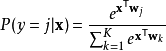
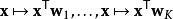
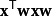

# Softmax函数
  Softmax函数也称归一化指数函数，是逻辑函数的一种推广。它能将一个含任意实数的K维向量“压缩”到
  另一个K维实向量中，使得每一个元素的范围都在(0,1)之间，并且所有元素的和为1。

该函数的形式通常按下面的式子给出：函数.jpg)其中， j = 1, …, K

Softmax函数实际上是有限项离散概率分布的梯度对数归一化。因此，Softmax函数在包括多项逻辑回归，
多项线性判别分析，朴素贝叶斯分类器和人工神经网络等的多种基于概率的多分类问题方法中都有着广泛应用。
特别地，在多项逻辑回归和线性判别分析中，函数的输入是从K个不同的线性函数得到的结果，而样本向量x属于
第j个分类的概率为：

这可以被视作K个线性函数
Softmax函数的复合（）

# Softmax函数有关的例子   
输入向量[1,2,3,4,1,2,3]对应的Softmax函数的值为[0.024,0.064,0.175,0.475,0.024,0.064,0.175]。
输出向量中拥有最大权重的项对应着输入向量中的最大值“4”。这也显示了这个函数通常的意义：对向量进行归一化
，凸显其中最大的值并抑制远低于最大值的其他分量。

下面是使用Python进行函数计算的示例代码

    import math
    z = [1.0, 2.0, 3.0, 4.0, 1.0, 2.0, 3.0]
    z_exp = [math.exp(i) for i in z]  
    print(z_exp)  
Result: [2.72, 7.39, 20.09, 54.6, 2.72, 7.39, 20.09]

    sum_z_exp = sum(z_exp)
    print(sum_z_exp) 
Result: 114.98 

    softmax = [round(i / sum_z_exp, 3) for i in z_exp]
    print(softmax)
Result: [0.024, 0.064, 0.175, 0.475, 0.024, 0.064, 0.175]

 