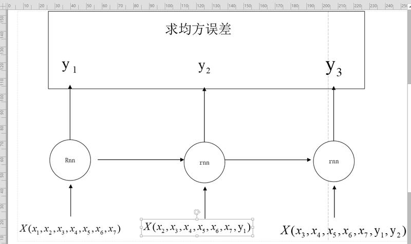
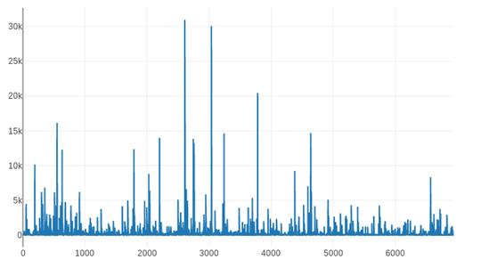
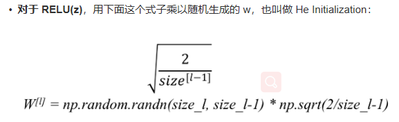

### Q:老师，如果说进一步的学习的话，需要熟练c++甚至看tensorflow的源代码来理解机器学习和深度学习的算法吗？
熟练源代码不是必须的，就像现在大多数程序员不需要从汇编语言学起一样，但是算法思路，徒手实现一些经典算法，对于水平快速提高很有帮助的
### Q:老师，我现在在做时序预测，数据大部分变化不大，存在在某些时刻突变且变化较大（不是异常数据），用回归模型或者深度学习预测单步还行，预测多步发现多步预测结果之间变化不大，似乎偏向数据变化不大模型，这个怎样也能保证突变情况下也能准确预测呢？
我建议使用LSTM相关模型，因为可以动态的记忆以前的结果，你可以试试
### Q:导师您好，请问输入模型的特征能动态改变吗？ 就像一对多的rnn，下一时刻的输入是上一时刻的输出， 但是我想在这个输入中多加编码一点东西能行吗？ 我不太会写代码实现这个想法…如果可行能指点一下吗，谢谢.

你好，可以动态改变，RNN，LSTM，GRU 是典型的处理时间序列数据的模型，你可以看看
 
### Q:  老师您好，请教一个曲线拟合的问题，假设我用多项式回归的方法去拟合一条曲线，有没有办法能够确保当x无限大的时候，y一定是正数 ？
 拟合曲线德结果和训练数据有关，如果一定是正数，那就忽略奇数次项试试，但是很容易过拟合，注意使用加入惩罚因子
### Q:老师好！今天读到西瓜书28页2.2.4第三段话：‘因此，在模型选择完成后，学习算法和参数配置已选定，此时应该用数据集D重新训练模型。这个模型在训练过程中使用了所有m个样本，这才是我们最终提交给用户的模型’。 我对 ‘用数据集D重新训练模型’ 这句话有些疑惑，我的理解：，以elastic logistics为例：样本D经10折交叉验证训练，确定最优惩罚参数λ和α。最终要把λ和α重新带入D进行训练。得到模型：sigmoid(w1x1+w2x2+w3x3......+intercept)。这才最终确定了每个feature（如x1）的系数(如w1)和intercept，进而提交给用户，对吗？
 
 
 
 交叉训练后，选择最好的模型超参数，然后用整个数据集再训练一遍，得到更加准确的结果，你的理解是对的
### Q:  请问老师，图片语义分析应该可以看成多标签多类的问题的。我只知道对于多标签问题最后一个激活层要用sigmoid进行出来。下面这个图是对每个标签出现的次数进行统计，可以看出标签分布非常不均衡。我的数据是35000张图片，6941个类别，每个图片大概只有20-40个类别左右。请问老师对于这种问题给我几个建议
 
 
 因为类别分布不均匀，所以考虑label多的样本损失函数给予小的权重，label少的分配大一点的权重，不然model容易很快的被优化
 第二可以考虑batch里面的采样尽量均匀，不要出现batch里面某一类label过多
 第三可以考虑一下focal loss
### Q:  老师，式8.2到8.3怎么推？然后8.5是什么意思啊？
 8.2到8.3是由Hoeffding不等式推出来的，你可以看一下这个博客链接：机器学习数学原理（8）——霍夫丁不等式 - CSDN博客。
 8.5就是指数损失函数，是一种损失函数，衡量真实值f(x)和预测值H(x)的偏差程度。
### Q:深度学习中权重初始化使用relu时候，权重初始化He 公式是哪种呢 2/np.sqrt(神经元数量)  还是 np.sqrt(2/神经元数量)
  
### Q:老师，我们在实际应用中，怎么确定使用高斯贝叶斯还是多项式贝叶斯，还是伯努利贝叶斯？是根据特征是连续还是离散来区分吗？
 比如人的身高这种特征，明显是符合高斯分布的，所以选高斯。比如文本分类的词频，明显是多项式特征，所以选择多项式
### Q:  老师您好，在目标检测的SSD算法中，default box、prior box是一回事吗？如何计算它们的数量呢？
  default box, prior box 以及 anchor 应该都是一个意思，都是在feature上面每一个点按照预设好的长宽和比例进行生成，数目是提前设定好的
### Q:请问老师，对于声音信号进行机器学习分类，比如电机的正常音和异音的分类。老师有做过这方面的项目吗？或者老师有什么建议
 没有做过。声音不同，信号不同，数字化后的向量不同，二分类问题，应该可以做。关键声音采集的质量够好么，也就是你采集过来的正常音或异常音存在区分度。
### Q:encoder-decoder模型可以应用到文本分类里吗？还是说它只能应用于生成文本？它的应用场景有哪些呢？
  不可以，主要用于文本生成，比如翻译/对话/摘要生成/生成式问答
### Q:请问，PCA降维后，形成了1个主成分PC1。如何算出，原始数据特征（比方说有T1，T2，T3，T4，T5，T6，T7，T8，T9）分别对主成分PC1的贡献大小？
 https://blog.csdn.net/zbc1090549839/article/details/38022147
### Q:廖老师好，我看到您前边回答别人说学完可以达到intern的级别，我想请你帮忙告知，如果我想要求层次更高，该如何进行呢？这门课我争取学快点，后边什么思路呢
 把课程训完之后，下一步是尝试复现经典论文，过一段时间我会逐步放上一些适合复现的论文和github上的参考代码，另外需要做一些小的project，这些我都会逐步放出来让大家学习
### Q:老师，利用SelectKBest 挑选特征处理分类问题，pvalues和scores_的评估分数有什么差别？这两个参数评估特征的值分别达到多大才算是可用性高的特征？我用并且pvalue的值为什么还有负数的情况？
  scores就是你用特征选择的评分函数的分数，比如卡方检验。而p-value是统计学中概念，挺复杂的，简单来说就是结论的风险，这个值越小风险越小。所以一般这个值正好是和scores相反。做selectbest都是根据score进行选择的，选择出分数最高的k个特征。
### Q:老师你好，请问如何确定网络层数，和每层节点数？。之前学过mlp，我只能通过看判别面(低维情况)和是否线性可分简单确定… 如果自己设计模型，级联一些东西，是从哪个地方联最好？模型设计出来后如何论证这是最优的配置？谢谢
  mlp是一个比较难调的东西，因为mlp的一些任务用传统的机器学习可能有更好的性能，mlp容易过拟合，所以不用纠结mlp，深度学习里面几乎不会用mlp作为主模型，更多的是cnn和rnn，这两个模型有非常多的论文可以看，所以网络结构不需要自己设计
### Q:  廖老师，您好，我发现caffe的网络可视化效果特别棒，用的prototext在netscope下的可视化，出来的网络流程很清晰，交流很方便，如下图。
      但是Pytorch似乎没有这么好的工具进行可视化，我查到了Pytorch-tensorboard，但是输出的网络很乱，不直观，和别人交流比较困难。
      请问有什么比较好的Pytorch的网络可视化工具吗？
      另外Pytorch的网络可视化是不是都是通过onnx模块进行转化的，导致不管用什么工具出来的可视化效果都是差不多的？
      谢谢廖老师～
 除了caffe可以用这个netscope之外，别的框架都是没办法用的，最多只能用tensorboard可视化，如果比较混乱，也是没有办法的事情。如果非要用caffe的可视化，可以考虑这个工具
 链接：GitHub - longcw/pytorch2caffe: Convert PyTorch model to Caffemodel
 
 将pytorch的model转成caffe，然后可视化prototxt
### Q:老师您好，我想了解一下如何分析一个网络的性能。除了直接对预测值建立评价指标外，有没有其他的手段？
      或许不是很严格，不是定量的，但是可以让我们对该网络的性能有更加深入的了解。
      比如查看关键节点特征图之类的手段？
  一般来说数值结果是最具好的，不管是比赛还是论文，都会给数值结果，如果非要找一些非数值结果来反映网络性能，那可以可视化一些网络中某些层weight的概率分布，或者是embedding空间的feature分布，或者可视化一些错误样本，来看一下是不是难样本，或者可视化bounding box等等
### Q:请问下老师关于Ridgecv中的cv的意思是采用的k折交叉验证得到的alpha还是针对每个alpha的采用交叉验证的到最好的权重，然后RidgeClassifier有什么用跟Ridge有什么区别
 Ridgecv应该是直接选出最优alpha,并且按最优的alpha进行训练。 classifier就是分类器啊
### Q:树模型的特征可以直接是字符串的形式吗，需要labelencode吗
  树模型不能直接处理字符串特征，必须将其数字化。但是如果你用lightgbm的话，可以直接输入并指定离散的类别特征，它将会自动将其转换成one-hot形式，比如西瓜的纹理。
### Q:请老师简单辨析一下NA,NAN,None的区别呗，以及isnan()，isnull()和Python语法里的is None的区别。我发现numpy里的nan用语法“i is None”竟然检测不出，而似乎pandas里面的缺失值用is none就可以检测出来，可能nan和None不是一个意思？这里比较混乱，多谢老师！
  None是python中的None类型，一种特殊数据类型，记不是字符串也不是数类型。而pandas中的空值用Nan表示。所以None, NaN, 空字符串''，空格字符串' '，是不同的。一般我们用pandas读数据文件，比如csv, 读进来的一般只有三种即空值/空字符串/空格字符串，读取的时候默认会把空值置换成Nan。当然你也可以在read_csv的参数中设置将空字符串也自动转换成Nan。而用isnull()判断的时候只能识别NaN,空字符串它无法识别。而你说的NA,null...啥的代表的都是空值，pandas读数据的时候，会把这个转成NaN。
### Q:您好，老师，能帮忙解决一下3.1和3.2吗，尤其是3.2 推导公式这个，特懵
 一般我们分析w对y影响时，或讨论y对w的梯度时，为了简便，可能就不会去考虑b。至于证明凸函数这个问题，可以凸函数定义法，但是不太现实，可以证明其hessian矩阵正定，这个我不太想证，太麻烦了，你自己证一下吧
### Q: 
 你理解的没问题啊。你举的那个材料优劣的例子确实可以如你所说那样做，而且有很多人那样做的。红蓝也可以像你那样说的那样做，而且没什么问题。只是有时候onehot离散化有它的好处，比如针对lr模型时onehot很合适。不用纠结，特征还得具体问题具体模型具体分析，不要固化，大胆去试。
### Q:  好的，多谢老师！还有个小问题想和您讨论一下，就是，如果把categorical特征值给one-hot编码了，相当于默认该特征的各个取值距离相等;而如果变成简单的一维特征，我们人为的给了“分数”，比如那个材料优劣的问题，如果我给定的是[0,1,2,3,4]，那是不是也会有我们“打分”不合理的隐患？具体说也就是可能较好和普通之间的差别应该显著小于极佳和较好的差别，如果有这样的前提情况在的话，我们是不是更倾向于这样指定特征取值——[0,1,2,3,6]呢？
      所以说这样我们人为的指定categorical特征取值会不会不合理地定义了某些特征值，而one-hot由于初始定义时互相之间没差别，经模型运算后模型给了它们各个特征取值之间的“远近程度”，从而导致one-hot其实更好一些呢？或者这还是个具体问题具体分析的事情呢？
  
### Q:  老师，我对您代码中fit_transform和transform使用区别不懂，上网查了一下也是很模糊。
 fit_transform等于先fit再transform
### Q:老师这个l1和l2的区别是什么，为什么能起到惩罚作用
  你看一下范数 的百度百科就知道l1和l2的区别了。
  为什么能惩罚？比如，原来要最小化f(w),而现在要最小化f(w)+l(w)了，必然会使w偏向最小化l(w)的方向移动啊，所以说惩罚啊。
### Q:  老师，情感分析和文本分类有什么区别吗，都是预处理，分词，向量化，提特征，最后分类器一分。它们的本质区别是什么？
本质区别是类别跟人类情感相关的文本分类，我们可称之为情感分析。或者说情感分析是文本分类的一个应用，或者说情感分析是文本分类的一个特例。
### Q:老师，请问在多类别中，某一类的查全率和查准率可能均为0，这会导致F1 Score为0/0，请问如何处理？
  可以在公式的分母项加个 特别小的常数防止分母为0.
### Q:KNN如果K取奇数但是有距离相同的怎么办啊
 最简单的处理方法就是从距离相同的样本中随机选择一个啊
### Q:老师，还是关于伯努利朴素朴素贝叶斯和多项式的问题。我感觉如果多项式的平滑因子取0，那么和伯努利是一样的呀。
      那么sklearn说 “与多项分布朴素贝叶斯的规则不同 伯努利朴素贝叶斯明确地惩罚类y中没有出现作为预测因子的特征i，而多项分布分布朴素贝叶斯只是简单地忽略没出现的特征。”怎么理解呢？谢谢
  你推导一下为啥多项式平滑因子取0，和伯努利是一样的，我看了一下，大概就是多项式贝叶斯如果特征没有发生，p(xi|y)的分子就为平滑因子吧，伯努利贝叶斯如果特征没有发生，p(i|y)就是特征i没发生的概率。应该是这个意思吧，强行解释一波捂脸
### Q:请问老师，公式推导对机器学习岗位的意义是什么，熟悉公式吗？
我觉得先熟悉算法思想，关键公式就好。比如，西瓜书中有些求导的问题和解方程的问题，没必要花太多精力自己手动算一遍。
### Q:老师您好，西瓜书58页下半部分关于咯个i身体差 regression的优点，"它是直接对分类可能性建模，无需事先假设数据分部" 这一段不知道该怎么理解。后面它还用了最大似然，据我所知最大似然是要先假设一个分布后才估计的参数啊。觉得有点矛盾。望指教，谢谢！
比如对于二分类，我们需要去拟合的函数是一个样本属于正例的概率。为什么要强调拟合概率，是因为有很多算法，比如svm只能预测某个样本是否属于正例，而无法预测其概率。
还有，关于极大似然估计，就是我们先假设出概率函数的形式，然后求其参数值。这里的概率回归函数是属于什么分布？高斯还是其他？
  
### Q:
  
### Q:
 
### Q:
 
### Q:
  
### Q:
 
### Q:
  
### Q: 

### 
 
### 
 
### 
 
### 
  
### 
  
### 
  
### 
  
### 
  
### 
 
### 
  
### 
 